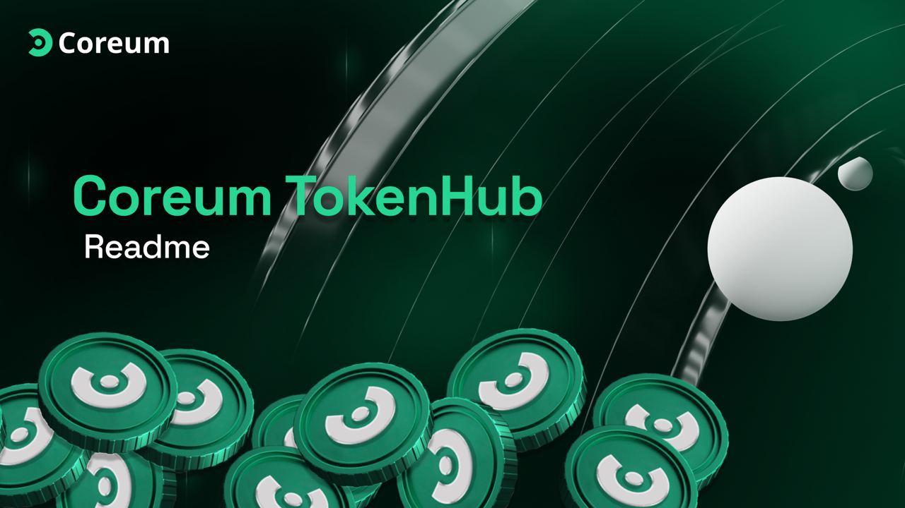
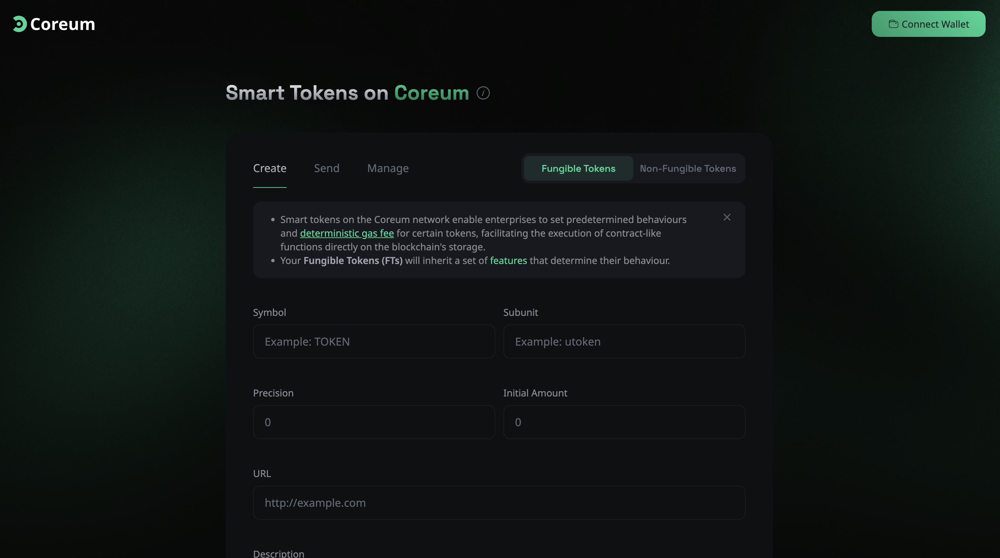

# Smart Tokens on the Coreum Network[🌐🔗](https://token-hub.coreum.dev/ft/create)



The Coreum TokenHub empowers enterprises and users alike to create and manage [Smart Tokens](https://www.coreum.com/smart-tokens). With predefined behaviors and deterministic gas fees, tokens issued on Coreum are able to execute advanced, contract-like functions directly on the blockchain. The platform provides a robust framework for token management, offering flexibility and control to meet diverse business, user, and community needs.

#### Access WebApp: https://token-hub.coreum.dev/

## 🛠️ Documentation

For detailed technical information on Smart Tokens, refer to the [documentation](https://docs.coreum.dev/docs/overview/smart-tokens).

## 🌟 Token Features

- **Minting (FTs):** 🪙 Allows the issuer to mint additional tokens.
- **Burning:** 🔥 Enables token holders to destroy their tokens. For NFTs, the issuer has the exclusive right to burn.
- **Freezing:** ❄️ Allows the issuer to freeze transactions up to a specified amount for FTs, or any NFT within a class.
- **Whitelisting:** 📋 Requires accounts to be approved by the issuer to receive tokens or hold specific NFTs.
- **IBC:** 🌉 Enables token transfer across IBC-enabled chains; if disabled, the token remains within the Coreum blockchain.
- **Block Smart Contract:** 🚫 Restricts tokens to be sent only to regular user addresses, not to smart contracts.
- **Disable Sending (NFTs):** 🛑 Prevents direct transfers of NFTs between users, encouraging the use of a DEX to ensure royalty payments to creators.
- **Soulbound (NFTs):** 🧬 NFTs cannot be transferred except by the issuer, ideal for user-specific tokens.
- **Clawback:** If the clawback feature is enabled on a token, then the admin of the token can confiscate up to the amount an account holds. The clawback amount cannot be more than what the user currently holds.
- **Access Control List:** The ACL(Access Control List) provides a flexible way for asset administration and is the relationships of the chain accounts and allowed features set on the asset issuance.

## 📊 Manage

View and manage the Smart Tokens you own. Connect your wallet to access and administer your assets through a public REST server that provides various endpoints for querying blockchain data.



## TokenHub + Netlify

[](https://app.netlify.com/sites/next-dev-starter/deploys)

### Getting Started (locally)

First, run the development server:

```bash
npm run dev
# or
yarn dev
```

Open [http://localhost:3000](http://localhost:3000) with your browser to see the result.

### Installation options

**Option one:** One-click deploy

[](https://app.netlify.com/start/deploy?repository=https://github.com/CoreumFoundation/token-hub)

**Option two:** Manual clone

1. Clone this repo: `git clone https://github.com/CoreumFoundation/token-hub.git`
2. Navigate to the directory and run `npm install`
3. Run `npm run dev`
4. Make your changes
5. Connect to [Netlify](https://url.netlify.com/Bk4UicocL) manually (the `netlify.toml` file is the one you'll need to make sure stays intact to make sure the export is done and pointed to the right stuff)

## TokenHub + Vercel

**Option one:** One-click deploy
[](https://vercel.com/new/clone?repository-url=https%3A%2F%2Fgithub.com%2FCoreumFoundation%2Ftoken-hub)

**Option two:** Manual clone

1. Clone this repo: `git clone https://github.com/CoreumFoundation/token-hub.git`
2. Navigate to the directory and run `npm install`
3. Run `npm run dev`
4. Make your changes
5. Connect to [Vercel](https://vercel.com/) manually (the `netlify.toml` file is the one you'll need to make sure stays intact to make sure the export is done and pointed to the right stuff)

# Disclaimer

The information provided on this platform is for general informational purposes only. Coreum TokenHub facilitates the creation, sending, and management of Smart Tokens on the Coreum network. However, Coreum does not assume any responsibility or liability for the implications, financial outcomes, legal consequences, or any other impact resulting from the use of this service, including but not limited to token generation events.

## Key Points:

- **No Endorsement**: Coreum does not endorse, sponsor, or validate any tokens created using the Coreum TokenHub. The creation and management of tokens are performed at the discretion and risk of the user.
- **User Responsibility**: Users are solely responsible for ensuring that their activities comply with all applicable laws, regulations, and guidelines. Coreum does not provide legal, financial, or professional advice.
- **No Liability**: Coreum shall not be held liable for any loss, damage, or harm arising from the use of the Coreum TokenHub, including but not limited to financial losses, legal actions, or regulatory penalties.
- **Security and Risks**: Users acknowledge the inherent risks associated with blockchain technology, including but not limited to security vulnerabilities, technological failures, and potential misuse of tokens. Users should conduct their own due diligence and take necessary precautions.

By using the Coreum TokenHub, you agree to release Coreum from any and all liability related to your use of the platform. This disclaimer is subject to change without notice.
